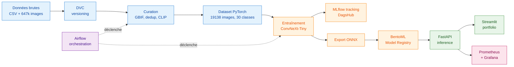
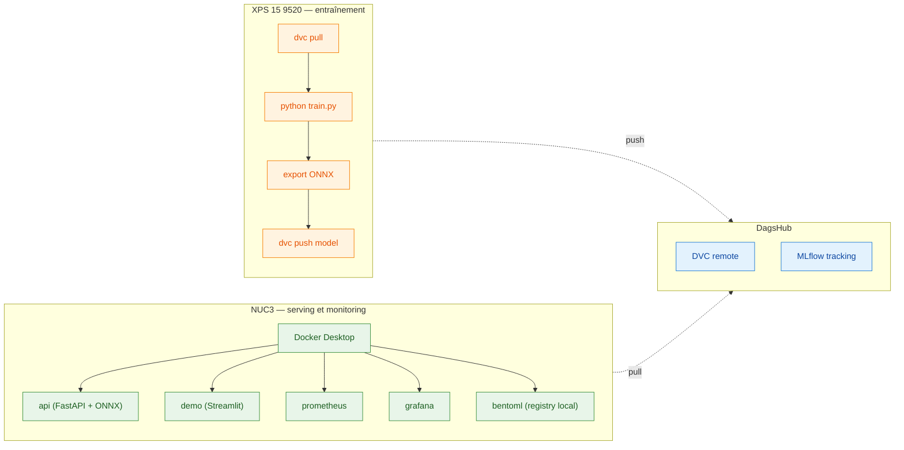

# Champy Classifier — Architecture du projet

**Version 2.0 — 14 mai 2026**
**Auteur : Dominique GEORGES**
**Statut : document de référence pour la clôture du projet (fin mai 2026)**

---

## Sommaire

1. [Vue d'ensemble](#1-vue-densemble)
2. [Topologie matérielle](#2-topologie-matérielle)
3. [Composants logiciels et rôles](#3-composants-logiciels-et-rôles)
4. [Flux de bout en bout](#4-flux-de-bout-en-bout)
5. [Choix structurants](#5-choix-structurants)
6. [État d'avancement et reste à faire](#6-état-davancement-et-reste-à-faire)
7. [Annexe : démarrage local](#7-annexe--démarrage-local)

---

## 1. Vue d'ensemble

Champy Classifier est un système de classification automatique de champignons sur trente espèces, construit autour d'un pipeline MLOps complet. Le projet répond à un travail de fin d'études du Master IA DataScientest / Mines Paris PSL (RNCP niveau 7, promotion 2026), avec une exigence forte de reproductibilité, de traçabilité et de séparation des préoccupations.

L'architecture repose sur une dizaine de composants qui couvrent l'ensemble du cycle de vie d'un modèle de Deep Learning : ingestion et curation des données, entraînement, suivi des expériences, mise en registre, exposition par API, monitoring, orchestration et intégration continue. Chaque composant a un rôle précis et reste découplé des autres, ce qui autorise les évolutions futures sans réécriture globale.



---

## 2. Topologie matérielle

Le projet est conçu pour fonctionner sur deux machines aux rôles distincts. L'une est dédiée à l'entraînement (GPU, calcul intensif et ponctuel), l'autre au serving et au monitoring (CPU, fonctionnement continu).



L'entraînement n'est jamais réalisé sur NUC3 (CPU uniquement, irréaliste pour un ConvNeXt). Le serving n'est jamais réalisé sur XPS (machine de travail, non dédiée). Les deux machines se synchronisent uniquement via DagsHub : modèles et données par DVC, métriques d'entraînement par MLflow.

---

## 3. Composants logiciels et rôles

Le projet vit dans deux Docker Compose distincts sur NUC3. Le premier regroupe la stack de serving et de monitoring (API, portfolio, Prometheus, Grafana). Le second isole Airflow (scheduler, webserver, base PostgreSQL de métadonnées). Cette séparation évite les redémarrages mutuels et facilite le développement indépendant des DAGs.

| Couche | Composant | Port interne | Port hôte | Rôle |
|---|---|---|---|---|
| Stockage | DVC + DagsHub | n/a | distant | Versioning des datasets, modèles et artefacts lourds |
| Tracking | MLflow (DagsHub) | n/a | distant | Suivi des expériences, métriques, hyperparamètres |
| Registry | BentoML | n/a | local fichier | Catalogue des modèles servis, avec labels et lien MLflow |
| Serving | FastAPI | 8000 | **8010** | API REST d'inférence à partir du modèle ONNX |
| Frontend | Streamlit (demo) | 8501 | 8501 | Portfolio interactif sur 13 pages |
| Monitoring | Prometheus | 9090 | 9090 | Collecte des métriques techniques et applicatives |
| Monitoring | Grafana | 3000 | **3010** | Visualisation des métriques, tableaux de bord |
| Orchestration | Airflow | 8080 | **8081** | Planification et exécution des DAGs |
| CI/CD | GitHub Actions | n/a | n/a | Tests, linting, build, déploiement |

Les ports hôtes ont été choisis au cas par cas pour éviter les conflits sur l'environnement de développement partagé. Les services arrivés en premier sur la machine (Streamlit et Prometheus) ont conservé leurs ports natifs ; les autres ont été décalés de +10 par rapport à leurs valeurs par défaut. Ce choix est documenté dans le PLAYBOOK et n'a pas d'incidence sur la production cible.

Le portfolio Streamlit comporte treize pages, présentées dans l'ordre du pipeline : `app`, `données brutes`, `nettoyage`, `augmentation`, `split`, `entraînement`, `évaluation`, `model registry`, `prédiction`, `api`, `monitoring`, `drift`, `infrastructure`, `analyse modèles`. L'ensemble est intégralement piloté par les données (zéro valeur codée en dur) et lit dynamiquement MLflow, le filesystem, l'API et Prometheus.

---

## 4. Flux de bout en bout

Le cycle de vie d'une version de modèle suit cinq étapes.

**Étape 1 — Ingestion et curation des données.** Le dataset brut provient de mushroomobserver.org (647 000 images, 30 espèces). Il est versionné dans DVC avec stockage distant sur DagsHub. Le pipeline de curation applique trois filtres successifs : filtrage de confiance GBIF, déduplication par hash perceptuel, et filtrage qualité par OpenCLIP ViT-B-32 à seuil 0.03. Le dataset curé final compte 19 138 images.

**Étape 2 — Entraînement.** Le Dataset PyTorch utilise un WeightedRandomSampler pour compenser le déséquilibre de classes (ratio naturel 61.7x). Trois configurations ont été entraînées en fine-tuning à deux phases : ResNet50 par défaut (84 %), ResNet50 agressif (88 %) et ConvNeXt-Tiny agressif (90 % d'accuracy, 81 % de F1 macro). Toutes les métriques, courbes et hyperparamètres sont loggés dans MLflow via DagsHub. ConvNeXt-Tiny est le modèle retenu pour la production.

**Étape 3 — Export et mise en registre.** Le modèle PyTorch est exporté en ONNX (106 MB, écart maximal PyTorch vs ONNX de 4e-6 validé sur dix échantillons). Il est ensuite importé dans BentoML avec un jeu de labels complet : version sémantique (`v2.0.0`), architecture (`convnext_tiny`), accuracy (`0.9000`), identifiant du run MLflow d'origine. Le lien entre registry et tracking est donc explicite et auditable.

**Étape 4 — Serving.** L'API FastAPI charge le modèle depuis BentoML et expose un endpoint d'inférence. Elle instrumente actuellement les métriques système Python via le `prometheus_client` (GC, mémoire process). L'instrumentation métier (compteur de prédictions, histogramme de latence, distribution des classes, confiance moyenne) est en cours d'ajout et fera l'objet d'un dashboard Grafana dédié. Le portfolio Streamlit consomme l'API et présente la performance du modèle, l'historique des expériences (lu dynamiquement depuis MLflow), et une démo interactive de prédiction sur image utilisateur.

**Étape 5 — Orchestration et automatisation.** Airflow exécute deux DAGs. Le DAG `hello_world` valide l'environnement (accès Python, variables d'environnement, montage du code projet). Le DAG `champy_train_pipeline` régénère les analyses à la demande via la commande `python -m scripts.generate_analysis`. Les DAGs montent le code projet en volume sur `/opt/champy` et héritent des variables d'environnement MLflow du conteneur Airflow.

---

## 5. Choix structurants

**ConvNeXt-Tiny plutôt que ResNet50.** Trois configurations ont été entraînées et comparées dans MLflow. ConvNeXt-Tiny offre le meilleur compromis performance / taille (106 MB en ONNX) et conserve une architecture moderne (2022) défendable techniquement. ResNet50 reste documenté dans MLflow comme baseline d'itération.

**Quatre outils MLOps séparés plutôt qu'une plateforme unique.** DVC pour les données, MLflow pour le tracking, BentoML pour le registry, Airflow pour l'orchestration. Chaque outil est utilisé pour ce qu'il fait de mieux, sans couplage fort. Ce choix favorise la lisibilité du pipeline, l'audit indépendant de chaque étape et la substituabilité future de tout composant.

**FastAPI conservé pour le serving plutôt que `bentoml serve`.** BentoML est utilisé comme Model Registry et bibliothèque de chargement, pas comme framework de serving. Cela permet de conserver le contrôle complet sur l'API (middlewares personnalisés, métriques Prometheus précises, validation Pydantic) sans dépendre du modèle de service intégré de BentoML.

**Séparation physique entraînement / serving.** Le XPS (GPU RTX 3050 Ti) prend en charge l'entraînement, le NUC3 (CPU, fonctionnement continu) prend en charge le serving et le monitoring. Cette séparation reflète la pratique de production réelle : on n'entraîne pas sur sa machine de production, et inversement.

**Airflow dans un Compose séparé.** Sa stack interne (scheduler, webserver, métadonnées Postgres) est lourde et son cycle de vie diffère de celui du serving. Les deux Compose se rencontrent par volumes partagés et variables d'environnement, sans réseau Docker commun, ce qui isole les redémarrages.

**Mapping de ports au cas par cas.** Pas de convention uniforme imposée : les services arrivés en premier ont conservé leurs ports natifs (Streamlit 8501, Prometheus 9090), les autres ont été décalés de +10 (API 8010, Grafana 3010, Airflow 8081). Le mapping est documenté dans les `docker-compose.yml`.

---

## 6. État d'avancement et reste à faire

**Ce qui fonctionne aujourd'hui**

- Pipeline de curation des données, reproductible de bout en bout via DVC
- Trois modèles entraînés, comparés et tracés dans MLflow
- Modèle de production (ConvNeXt-Tiny v2.0.0) exporté en ONNX, validé, importé proprement dans BentoML avec traçabilité MLflow complète
- API FastAPI opérationnelle, validée par quatre prédictions de test à 98–100 % de confiance
- Portfolio Streamlit complet sur treize pages, zéro valeur codée en dur
- Stack monitoring Prometheus + Grafana câblée et instrumentée sur métriques système
- Airflow opérationnel, deux DAGs verts (`hello_world`, `champy_train_pipeline`)
- GitHub Actions CI/CD à cinq jobs

**Reste à faire avant le 31 mai**

- Instrumentation métier de l'API FastAPI : compteurs de prédictions, histogramme de latence d'inférence, distribution des classes prédites, confiance moyenne
- Dashboard Grafana dédié consommant ces nouvelles métriques
- Migration du chargement du modèle dans l'API vers `bentoml.onnx.load_model("champy_classifier:latest")`
- Correction du faux positif "Docker not in PATH" dans la page `infrastructure` du portfolio (le container Streamlit n'a pas accès au socket Docker hôte)
- Rédaction du `README.md` d'installation, autosuffisant pour un installeur non technique, Windows et Linux
- Production des scripts d'installation `install.ps1` (Windows) et `install.sh` (Linux/WSL)
- Test de désempaquetage sur XPS Windows et sur WSL Ubuntu
- Production du zip final auto-installable

**Ce qui ne sera pas livré dans cette version**

- Pipeline de retraining automatique déclenché sur dérive détectée
- Réglage automatique des hyperparamètres
- Déploiement sur infrastructure externe (cloud, Kubernetes)

Ces points sont identifiés comme axes d'évolution pour une éventuelle V2 post-soutenance et seront mentionnés en perspective dans le mémoire.

---

## 7. Annexe : démarrage local

### Prérequis

- Docker Desktop (Windows / macOS) ou Docker Engine + Compose plugin (Linux)
- Git
- 16 Go de RAM minimum, 32 Go recommandés
- Compte DagsHub avec accès au repo `LoicFocraud/Champy_Classifier` (uniquement pour `dvc pull`, pas pour la démo)

### Démarrage de la stack principale

```bash
cd Champy_Classifier
docker compose up -d
```

### Démarrage de la stack Airflow

```bash
cd Champy_Classifier/airflow
docker compose up -d
```

### URLs locales

| Service | URL |
|---|---|
| API FastAPI | http://localhost:8010 |
| Documentation API (Swagger) | http://localhost:8010/docs |
| Portfolio Streamlit | http://localhost:8501 |
| Grafana | http://localhost:3010 |
| Prometheus | http://localhost:9090 |
| Airflow UI | http://localhost:8081 |
| MLflow (distant) | https://dagshub.com/LoicFocraud/Champy_Classifier.mlflow |

### Commandes utiles

```bash
# Lister les modèles dans BentoML
bentoml models list

# Voir le détail du modèle de production
bentoml models get champy_classifier:latest

# Suivre les logs Airflow en continu
docker logs champy_airflow -f

# Récupérer les données versionnées (nécessite credentials DagsHub)
dvc pull -r origin_https
```

---

*Ce document est versionné dans le repo Champy_Classifier sous `docs/ARCHITECTURE.md`. Toute évolution de l'architecture doit être reportée ici avant d'être considérée comme actée. Le `README.md` à la racine du repo couvre la procédure d'installation pas à pas, distincte de la présente documentation d'architecture.*
