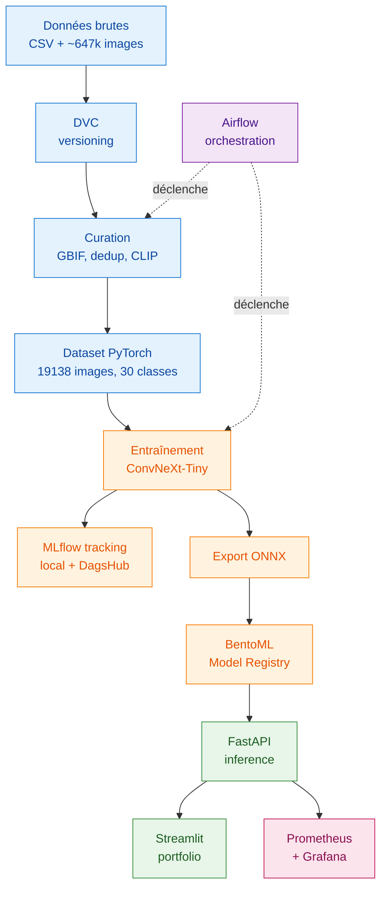
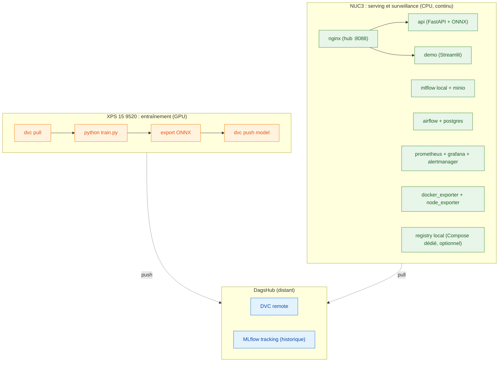

# Champy Classifier : architecture du projet

**Version 2.1, 31 mai 2026**
**Auteur : Dominique GEORGES**
**Statut : document de référence pour la clôture du projet (soutenance du 16 juin 2026)**

---

## Sommaire

1. [Vue d'ensemble](#1-vue-densemble)
2. [Topologie matérielle](#2-topologie-matérielle)
3. [Composants logiciels et rôles](#3-composants-logiciels-et-rôles)
4. [Flux de bout en bout](#4-flux-de-bout-en-bout)
5. [Choix structurants](#5-choix-structurants)
6. [État d'avancement et reste à faire](#6-état-davancement-et-reste-à-faire)
7. [Annexe : démarrage local](#7-annexe--démarrage-local)

---

## 1. Vue d'ensemble

Champy Classifier est un système de classification automatique de champignons sur trente espèces, construit autour d'un pipeline MLOps complet. Le projet répond à un travail de fin d'études du Master IA DataScientest / Mines Paris PSL (RNCP niveau 7, promotion 2026), avec une exigence forte de reproductibilité, de traçabilité et de séparation des préoccupations.

La stack de production réunit treize conteneurs qui couvrent l'ensemble du cycle de vie d'un modèle de Deep Learning : ingestion et curation des données, entraînement, suivi des expériences, mise en registre, exposition par API, surveillance, orchestration et intégration continue. Chaque composant a un rôle précis et reste découplé des autres, ce qui autorise les évolutions futures sans réécriture globale.



---

## 2. Topologie matérielle

Le projet est conçu pour fonctionner sur deux machines aux rôles distincts. L'une est dédiée à l'entraînement (GPU, calcul intensif et ponctuel), l'autre au serving et à la surveillance (CPU, fonctionnement continu). Les deux ne se synchronisent que par DagsHub.



L'entraînement n'est jamais réalisé sur NUC3 (CPU uniquement, irréaliste pour un ConvNeXt). Le serving n'est jamais réalisé sur XPS (machine de travail, non dédiée). Les deux machines se synchronisent uniquement via DagsHub : modèles et données par DVC, historique des métriques d'entraînement par MLflow. Sur NUC3, un serveur MLflow local sert par ailleurs de cible au pipeline orchestré (voir section 3).

---

## 3. Composants logiciels et rôles

La stack de production tient dans un seul Docker Compose principal (`docker-compose.yml`, treize services) qui réunit le serving, la surveillance et l'orchestration Airflow. Un second Compose dédié et optionnel (`docker-compose.registry.yml`) fournit un registre d'images Docker privé pour le déploiement continu ; il se lance à part et n'est pas nécessaire à la démonstration. Cette séparation isole l'outillage CI/CD du cycle de vie de la stack applicative.

Tous les services exposés passent par un point d'entrée unique, le reverse-proxy `nginx` sur le port hôte `8088`, avec routage par sous-chemin.

| Couche | Composant | Port interne | Port hôte | Rôle |
|---|---|---|---|---|
| Entrée | nginx | 80 | **8088** | Reverse-proxy unique, routage par sous-chemin |
| Stockage | DVC + DagsHub | n/a | distant | Versioning des datasets, modèles et artefacts lourds |
| Tracking | MLflow (local) | 5000 | **5050** | Suivi des expériences, cible du pipeline orchestré |
| Tracking | MLflow (DagsHub) | n/a | distant | Historique de référence des entraînements |
| Stockage S3 | MinIO | 9000 / 9001 | **9010** / **9011** | Stockage objet auto-hébergé (artefacts MLflow) |
| Registry modèle | BentoML | n/a | local fichier | Catalogue des modèles servis, labels et lien MLflow |
| Serving | FastAPI | 8000 | **8010** | API REST d'inférence à partir du modèle ONNX |
| Frontend | Streamlit (demo) | 8501 | 8501 | Portfolio interactif, exploration du pipeline |
| Surveillance | Prometheus | 9090 | 9090 | Collecte des métriques techniques et applicatives |
| Surveillance | Grafana | 3000 | **3010** | Tableaux de bord de visualisation |
| Surveillance | Alertmanager | 9093 | **9193** | Routage des alertes |
| Surveillance | Relais Discord | n/a | n/a | Passerelle Alertmanager vers Discord |
| Surveillance | docker_exporter | 9417 | 9417 | Métriques CPU/RAM/IO par conteneur (API Docker) |
| Surveillance | node_exporter | 9100 | 9101 | Métriques de l'hôte (CPU, RAM, disque, réseau) |
| Orchestration | Airflow + Postgres | 8080 | **8081** | Planification et exécution des DAGs |
| CI/CD | GitHub Actions | n/a | n/a | Tests, linting, build |
| CI/CD | Registre Docker (optionnel) | 5000 / 80 | 5000 / 5001 | Registre d'images privé, via Compose dédié |

Les ports hôtes ont été choisis au cas par cas pour éviter les conflits sur l'environnement de développement partagé. Les services arrivés en premier sur la machine (Streamlit et Prometheus) ont conservé leurs ports natifs ; les autres ont été décalés de +10 par rapport à leurs valeurs par défaut. Ce choix est documenté dans le PLAYBOOK et n'a pas d'incidence sur la production cible, où tout passe par le hub nginx.

Le portfolio Streamlit présente les étapes du pipeline dans l'ordre (données brutes, nettoyage, augmentation, split, entraînement, évaluation, registre de modèle, prédiction), complétées par des pages transverses (API, monitoring, drift, infrastructure, analyse des modèles, plateforme). L'ensemble est intégralement piloté par les données (zéro valeur codée en dur) et lit dynamiquement MLflow, le filesystem, l'API et Prometheus.

---

## 4. Flux de bout en bout

Le cycle de vie d'une version de modèle suit cinq étapes.

**Étape 1. Ingestion et curation des données.** Le dataset brut réunit environ 647 000 images couvrant de nombreuses espèces, issues de Mushroom Observer et iNaturalist. Il est versionné dans DVC avec stockage distant sur DagsHub. Le pipeline de curation applique trois filtres successifs : filtrage de confiance GBIF, déduplication par hash perceptuel, et filtrage qualité par OpenCLIP ViT-B-32 à seuil 0.03. Le dataset curé final compte 19 138 images réparties sur les 30 espèces retenues.

**Étape 2. Entraînement.** Le Dataset PyTorch utilise un WeightedRandomSampler pour compenser le déséquilibre de classes (ratio naturel 61.7x). Trois configurations ont été entraînées en fine-tuning à deux phases : ResNet50 par défaut (84 %), ResNet50 agressif (88 %) et ConvNeXt-Tiny agressif (90 % d'accuracy, 81 % de F1 macro). Toutes les métriques, courbes et hyperparamètres sont loggés dans MLflow via DagsHub. ConvNeXt-Tiny est le modèle retenu pour la production.

**Étape 3. Export et mise en registre.** Le modèle PyTorch est exporté en ONNX (106 MB, écart maximal PyTorch vs ONNX de 4e-6 validé sur dix échantillons). Il est ensuite importé dans BentoML avec un jeu de labels complet : version sémantique (`v2.0.0`), architecture (`convnext_tiny`), accuracy (`0.9000`), identifiant du run MLflow d'origine. Le lien entre registry et tracking est donc explicite et auditable.

**Étape 4. Serving et surveillance.** L'API FastAPI charge le modèle depuis BentoML et expose un endpoint d'inférence. Elle est instrumentée pour Prometheus via `prometheus_client`, à la fois sur les métriques système et sur les métriques métier (compteurs de prédictions, latence d'inférence, distribution et confiance des classes prédites). Côté infrastructure, deux exporters complètent la collecte : `node_exporter` pour les métriques de l'hôte et `docker_exporter` (interrogation directe de l'API Docker) pour les métriques par conteneur. L'ensemble alimente six tableaux de bord Grafana fonctionnels : performance de l'API, prédictions, santé système, conteneurs, hôte et impact écologique. Le portfolio Streamlit consomme l'API et présente la performance du modèle, l'historique des expériences lu dynamiquement depuis MLflow, une démo interactive de prédiction sur image utilisateur, et une page de détection de dérive (drift) appuyée sur Evidently.

**Étape 5. Orchestration et automatisation.** Airflow exécute deux DAGs. Le DAG `hello_world` valide l'environnement (accès Python, variables d'environnement, montage du code projet). Le DAG `champy_train_pipeline` régénère les analyses à la demande via la commande `python -m scripts.generate_analysis`. Les DAGs montent le code projet en volume sur `/opt/champy` et héritent des variables d'environnement MLflow du conteneur Airflow.

---

## 5. Choix structurants

**ConvNeXt-Tiny plutôt que ResNet50.** Trois configurations ont été entraînées et comparées dans MLflow. ConvNeXt-Tiny offre le meilleur compromis performance / taille (106 MB en ONNX) et conserve une architecture moderne (2022) défendable techniquement. ResNet50 reste documenté dans MLflow comme baseline d'itération.

**Quatre outils MLOps séparés plutôt qu'une plateforme unique.** DVC pour les données, MLflow pour le tracking, BentoML pour le registry, Airflow pour l'orchestration. Chaque outil est utilisé pour ce qu'il fait de mieux, sans couplage fort. Ce choix favorise la lisibilité du pipeline, l'audit indépendant de chaque étape et la substituabilité future de tout composant.

**FastAPI conservé pour le serving plutôt que `bentoml serve`.** BentoML est utilisé comme Model Registry et bibliothèque de chargement, pas comme framework de serving. Cela permet de conserver le contrôle complet sur l'API (middlewares personnalisés, métriques Prometheus précises, validation Pydantic) sans dépendre du modèle de service intégré de BentoML.

**Séparation physique entraînement / serving.** Le XPS (GPU RTX 3050 Ti) prend en charge l'entraînement, le NUC3 (CPU, fonctionnement continu) prend en charge le serving et la surveillance. Cette séparation reflète la pratique de production réelle : on n'entraîne pas sur sa machine de production, et inversement.

**Registre d'images dans un Compose séparé.** La stack applicative et le registre Docker privé ont des cycles de vie distincts : le registre sert au déploiement continu, pas à la démonstration. Il vit donc dans son propre `docker-compose.registry.yml`, lancé à la demande, ce qui évite de l'imposer à chaque démarrage de la stack et garde les redémarrages indépendants.

**Surveillance par exporters plutôt que par cAdvisor.** Les métriques par conteneur sont collectées via un exporter maison qui interroge l'API Docker, et non via cAdvisor. Ce dernier lit la structure overlay2 du filesystem, absente avec le stockage d'images containerd, alors que l'API Docker reste accessible quel que soit le storage driver. Le `node_exporter` couvre les métriques de l'hôte.

**Mapping de ports au cas par cas.** Pas de convention uniforme imposée : les services arrivés en premier ont conservé leurs ports natifs (Streamlit 8501, Prometheus 9090), les autres ont été décalés de +10 (API 8010, Grafana 3010, MLflow 5050, Airflow 8081). Le mapping est documenté dans le `docker-compose.yml`. En production, ce détail s'efface derrière le hub nginx.

---

## 6. État d'avancement et reste à faire

**Ce qui fonctionne aujourd'hui (31 mai)**

- Pipeline de curation des données, reproductible de bout en bout via DVC
- Trois modèles entraînés, comparés et tracés dans MLflow
- Modèle de production (ConvNeXt-Tiny v2.0.0) exporté en ONNX, validé, importé proprement dans BentoML avec traçabilité MLflow complète
- API FastAPI opérationnelle, validée par des prédictions de test à 98 à 100 % de confiance, instrumentée pour Prometheus sur les métriques système et métier (prédictions, latence, distribution des classes)
- Portfolio Streamlit complet, zéro valeur codée en dur, avec une page de prédiction qui signale clairement les images hors des 30 espèces (alerte de prédiction non fiable)
- Page de détection de dérive vulgarisée, appuyée sur Evidently, avec verdict en français et garde-fou sur les faibles volumes
- Stack de surveillance complète : six tableaux de bord Grafana fonctionnels et alimentés en continu (performance de l'API, prédictions, santé système, conteneurs, hôte, impact écologique), avec `node_exporter` et `docker_exporter`
- Airflow opérationnel, deux DAGs verts (`hello_world`, `champy_train_pipeline`)
- GitHub Actions (CI) : lint, tests, build
- Registre d'images Docker local disponible via un Compose dédié
- README d'installation autosuffisant à la racine, treize conteneurs documentés, architecture multi-compose explicitée

**En cours d'intégration (branche v1.1)**

- Déploiement continu automatisé : workflow de déploiement, runner self-hosted, page registre dans le portfolio
- Test d'installation depuis un clone neuf (reproductibilité complète, exporters et registre inclus)

**Ce qui ne sera pas livré dans cette version**

- Pipeline de retraining automatique déclenché sur dérive détectée
- Réglage automatique des hyperparamètres
- Déploiement sur infrastructure externe (cloud, Kubernetes)

Ces points sont identifiés comme axes d'évolution pour une éventuelle V2 post-soutenance et seront mentionnés en perspective dans le mémoire.

---

## 7. Annexe : démarrage local

### Prérequis

- Docker Desktop (Windows / macOS) ou Docker Engine + Compose plugin (Linux)
- Git
- 16 Go de RAM minimum, 32 Go recommandés
- Compte DagsHub avec accès au repo `LoicFocraud/Champy_Classifier` (uniquement pour `dvc pull`, pas pour la démo)

### Démarrage de la stack principale

```bash
cd Champy_Classifier
docker compose up -d
```

Treize conteneurs démarrent, dont Airflow et sa base Postgres (aucun Compose Airflow séparé à lancer). Une fois la stack opérationnelle, tout est accessible via le hub nginx sur `http://localhost:8088/`.

### Registre d'images (optionnel, pour le déploiement continu)

```bash
docker compose -f docker-compose.registry.yml up -d
```

Registre sur `localhost:5000`, interface web sur `localhost:5001`. Voir l'en-tête de `docker-compose.registry.yml` pour le prérequis `insecure-registries` côté Docker Desktop.

### URLs locales

| Service | URL |
|---|---|
| Hub nginx (point d'entrée) | http://localhost:8088/ |
| API FastAPI | http://localhost:8010 |
| Documentation API (Swagger) | http://localhost:8010/docs |
| Portfolio Streamlit | http://localhost:8501 |
| Grafana | http://localhost:3010 |
| Prometheus | http://localhost:9090 |
| MLflow (local) | http://localhost:5050 |
| MinIO (console) | http://localhost:9011 |
| Airflow UI | http://localhost:8081 |
| MLflow (historique distant) | https://dagshub.com/LoicFocraud/Champy_Classifier.mlflow |

### Commandes utiles

```bash
# Lister les modèles dans BentoML
bentoml models list

# Voir le détail du modèle de production
bentoml models get champy_classifier:latest

# Suivre les logs Airflow en continu
docker logs champy_airflow -f

# Récupérer les données versionnées (nécessite credentials DagsHub)
dvc pull
```

---

*Ce document est versionné à la racine du repo Champy_Classifier sous `ARCHITECTURE.md`. Toute évolution de l'architecture doit être reportée ici avant d'être considérée comme actée. Le `README.md`, également à la racine, couvre la procédure d'installation pas à pas, distincte de la présente documentation d'architecture.*
