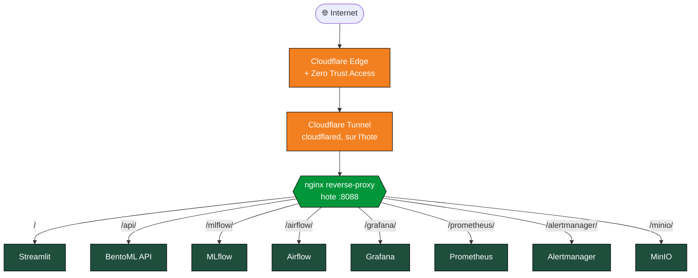

<div align="center">

# 🍄 Champy Classifier

**Photographiez un champignon, l'application reconnaît son espèce.**

Champy Classifier identifie 30 espèces de champignons à partir d'une simple photo.
Mais l'objet du projet va au-delà du modèle : il montre toute la chaîne qui amène
une intelligence artificielle de l'expérimentation jusqu'à un service en ligne
fiable, surveillé et reproductible, ce qu'on appelle le MLOps.

> ⚠️ Projet académique de démonstration. Il n'est pas conçu pour décider de la
> comestibilité d'un champignon : ne vous y fiez jamais pour la cueillette.

[](https://www.python.org/)
[](https://docs.docker.com/compose/)
[](https://pytorch.org/)
[](https://bentoml.com/)
[](https://mlflow.org/)
[](https://streamlit.io/)
[]()
[]()

**ConvNeXt-Tiny &nbsp;•&nbsp; 90 % de bonnes réponses &nbsp;•&nbsp; F1 macro 81 % &nbsp;•&nbsp; Empreinte d'entraînement ≈ 58 gCO₂eq (un espresso)**

</div>

---

## En une minute

Le projet couvre la chaîne complète d'un système d'apprentissage automatique, de la donnée brute jusqu'au service surveillé :

- **Apprendre** : un modèle de vision (ConvNeXt-Tiny) entraîné à distinguer 30 espèces.
- **Servir** : une API qui répond à une photo par une espèce, son niveau de confiance, et une carte de chaleur expliquant la décision.
- **Montrer** : un portail web où l'on teste le modèle et où l'on explore chaque étape du projet.
- **Surveiller** : des tableaux de bord qui suivent la santé du service et détectent si les données changent dans le temps (le *drift*).
- **Industrialiser** : tout est conteneurisé, testé automatiquement et reproductible d'une machine à l'autre.

---

## Équipe et cadre académique

**Travail de Fin d'Études**, Master *Intelligence Artificielle*, DataScientest x Mines Paris PSL (RNCP niveau 7). Soutenance le **16 juin 2026**.

| Co-auteurs | Mentor |
|---|---|
| Loïc FOCRAUD | 🎓 Kylian POILLY |
| Lionel SCHNEIDER | |
| Dominique GEORGES | |
| Saravana PREGASSAME | |

---

## Démarrage rapide

```bash
git clone https://github.com/<votre-org>/Champy_Classifier.git
cd Champy_Classifier
cp .env.example .env

# Données et modèle : gérés par DVC, stockés sur le remote DagsHub
pip install "dvc[s3]"
dvc pull

docker compose up -d --build
```

Onze conteneurs démarrent (API, démo, MLflow, MinIO, Airflow et la surveillance de base). Comptez 5 à 15 minutes au premier lancement. Une fois la stack opérationnelle, ouvrez **http://localhost:8088** dans votre navigateur.

> 🛠️ **Prérequis** : Docker Desktop 4.30+ (Windows / macOS) ou Docker Engine 24.0+ avec le plugin Compose v2 (Linux). Python 3.11 et un accès au remote DVC (identifiants DagsHub) pour le `dvc pull`. 16 Go de RAM. 20 Go de disque libre.

> ℹ️ Sans le `dvc pull`, les dossiers `data/` et `models/` restent vides après le clone (ils sont hors git) : la démo démarrerait sans modèle ni images d'exemple. C'est l'étape à ne pas sauter pour une installation propre.

---

## Architecture



Tous les services passent par un point d'entrée unique (`nginx` sur le port hôte `8088`), avec routage par sous-chemin. Le schéma montre les **services**, pas les ports : à l'intérieur du réseau Docker, chaque service garde son port standard (Streamlit 8501, API 8000, Grafana 3000, etc.), tandis que les ports exposés sur l'hôte ont un offset `+10` pour cohabiter avec d'autres projets (voir `docker-compose.yml`).

En production, l'ensemble est exposé derrière **Cloudflare Tunnel** (le démon `cloudflared` tourne sur l'hôte, hors stack Docker) et filtré par **Cloudflare Access** : une seule authentification SSO par e-mail (magic-link) donne accès à tous les sous-chemins sous `https://champy.sbdg-ia.fr/`. Aucun port n'est ouvert directement vers Internet.

Documentation détaillée : [`ARCHITECTURE.md`](ARCHITECTURE.md).

---

## Accès aux interfaces

Via le hub `nginx` (port `8088`), chaque service répond sur son sous-chemin :

| Service | Sous-chemin | Auth interne | Rôle |
|---|---|---|---|
| 🍄 Streamlit | `/` | bcrypt | Portail de démonstration, exploration des résultats |
| 🚀 BentoML API | `/api/` | aucune | Inférence, explicabilité, documentation OpenAPI |
| 📊 MLflow | `/mlflow/` | aucune | Suivi des entraînements et registre de modèles |
| 🌬️ Airflow | `/airflow/` | basic auth | Orchestration des pipelines |
| 📈 Grafana | `/grafana/` | anonyme (Viewer) | Tableaux de bord de surveillance |
| 🔥 Prometheus | `/prometheus/` | aucune | Métriques temporelles |
| 🚨 Alertmanager | `/alertmanager/` | aucune | Routage des alertes vers Discord |
| 💾 MinIO | `/minio/` | basic auth | Stockage S3 auto-hébergé (artefacts MLflow) |

En accès local direct (sans passer par le hub), les ports hôte sont : Streamlit `8501`, API `8010`, Grafana `3010`, MLflow `5050`, MinIO console `9011`, Airflow `8081`. La liste complète est dans `docker-compose.yml`. Les identifiants par défaut sont affichés dans la page **Plateforme** du portail Streamlit, avec des boutons « Copier ».

---

## Le modèle et son empreinte

| Indicateur | Valeur |
|---|---:|
| Architecture | ConvNeXt-Tiny (28 M paramètres) |
| Bonnes réponses (test) | 90 % |
| F1 macro | 81 % |
| Espèces classifiées | 30 |
| Empreinte d'entraînement | ≈ 58 gCO₂eq (un espresso) |
| Empreinte d'une prédiction | ≈ 0,005 mgCO₂eq |

L'entraînement complet émet environ 58 gCO₂eq, soit l'équivalent d'un espresso, ou d'environ 341 mètres parcourus en voiture diesel. Ces équivalents concrets sont repris dans le tableau de bord Grafana **Champy, Impact écologique**.

---

## Documentation complète

<details>
<summary><strong>🔬 Premier test de prédiction</strong></summary>

<br>

Le dossier `data/sample/` contient quelques images d'exemple.

**Via le portail Streamlit** (recommandé) :

1. Ouvrez http://localhost:8088/
2. Connectez-vous (un compte de démonstration est indiqué sur la page de connexion).
3. Allez sur la page **Prédiction** dans le menu de gauche.
4. Choisissez une image (envoi d'un fichier, exemple de la galerie, ou URL).
5. **Cliquez simplement sur une vignette** : la prédiction se lance automatiquement, sans bouton.

Dans la galerie, chaque vignette est encadrée : **en vert** si l'espèce fait partie des 30 que le modèle connaît, **en rouge** sinon. Si vous choisissez une image hors de ces 30 espèces, la page signale clairement que la prédiction n'est pas fiable (le modèle est obligé de répondre une des 30 espèces, même quand l'image n'en fait pas partie). La page affiche aussi le top-5 des espèces les plus probables et une carte de chaleur **Grad-CAM** qui met en évidence les zones de l'image ayant pesé dans la décision.

**Via l'API directement** :

```bash
# Prédiction
curl -X POST "http://localhost:8088/api/predict" \
     -F "image=@data/sample/100048.jpg"

# Disponibilité du service
curl http://localhost:8088/api/healthz
```

La documentation OpenAPI (Swagger) liste tous les points d'entrée disponibles, accessible depuis `/api/`.

</details>

<details>
<summary><strong>📦 Configuration des secrets</strong></summary>

<br>

Le fichier `.env.example` contient des valeurs par défaut suffisantes pour une démonstration locale. Pour une exposition publique, générez vos propres secrets :

```bash
# Cle Fernet (chiffrement des connexions Airflow)
python -c "from cryptography.fernet import Fernet; print(Fernet.generate_key().decode())"

# Cle secrete du webserver Airflow
python -c "import secrets; print(secrets.token_hex(32))"
```

Reportez les valeurs dans `.env` :

```env
AIRFLOW_FERNET_KEY=<sortie de la premiere commande>
AIRFLOW_WEBSERVER_SECRET=<sortie de la seconde commande>
GRAFANA_PASSWORD=<un mot de passe robuste>
MINIO_ROOT_PASSWORD=<un mot de passe robuste>
AIRFLOW_ADMIN_PASSWORD=<un mot de passe robuste>
DISCORD_WEBHOOK_URL=<l'URL du webhook Discord pour les alertes>
```

Puis :

```bash
docker compose up -d --force-recreate airflow grafana minio
```

</details>

<details>
<summary><strong>🖥️ Accès local et accès public</strong></summary>

<br>

**Accès local** (sur la machine d'installation) : tous les services sont accessibles via le hub nginx sur le port `8088` (`http://localhost:8088/<sous-chemin>/`). Les ports natifs restent aussi exposés pour le débogage, avec un offset `+10` (Streamlit `8501`, API `8010`, Grafana `3010`, MLflow `5050`, MinIO console `9011`, Airflow `8081`). La liste complète est dans `docker-compose.yml`.

**Accès public** (production) : la stack est exposée derrière Cloudflare Tunnel et protégée par Cloudflare Access. Une seule authentification SSO donne accès à l'ensemble des sous-chemins sous `https://champy.sbdg-ia.fr/`, par e-mail magic-link via Cloudflare Zero Trust. Aucun port n'est ouvert vers Internet sur la machine hôte.

</details>

<details>
<summary><strong>🌬️ Suivi des entraînements (MLflow)</strong></summary>

<br>

La stack inclut un serveur **MLflow auto-hébergé** (`/mlflow/`), avec une base SQLite pour les métadonnées et MinIO comme stockage des artefacts. C'est lui que vise le pipeline d'entraînement orchestré par Airflow.

L'historique de référence des entraînements du projet (comparaison ConvNeXt vs ResNet, modèle retenu) est par ailleurs tracé sur une instance **DagsHub** distante. Les deux ne contiennent donc pas forcément les mêmes runs : pensez à regarder la bonne instance selon ce que vous cherchez.

</details>

<details>
<summary><strong>🛑 Arrêt, redémarrage, désinstallation</strong></summary>

<br>

**Arrêt sans perte de données** :

```bash
docker compose down
```

Les volumes (Postgres Airflow, MLflow, MinIO, Grafana, Prometheus) sont conservés.

**Redémarrage** :

```bash
docker compose up -d
```

**Désinstallation complète** :

```bash
docker compose down -v
docker image prune -a -f --filter "label=com.docker.compose.project=champy_classifier"
```

Pour un nettoyage total, supprimez ensuite le dossier du projet.

</details>

<details>
<summary><strong>🛠️ Dépannage rapide</strong></summary>

<br>

**`Cannot connect to the Docker daemon`**

- Windows : Docker Desktop n'est pas lancé. Démarrez-le et patientez jusqu'au statut « Running ».
- Linux : votre utilisateur n'est pas dans le groupe `docker`. Exécutez `sudo usermod -aG docker $USER`, puis reconnectez-vous.

**`Port is already allocated`**

Un autre service occupe un port que la stack tente d'allouer. Identifiez-le :

- Windows : `Get-NetTCPConnection -LocalPort 8088 | Select-Object OwningProcess`
- Linux : `sudo lsof -i :8088`

Soit vous arrêtez le service conflictuel, soit vous modifiez le port hôte dans `docker-compose.yml`.

**nginx en état `unhealthy` après un `--force-recreate`**

Quand un conteneur backend est recréé, son IP Docker change mais nginx garde l'ancienne en cache DNS :

```bash
docker compose restart nginx
```

**Streamlit affiche `Connection error` pour l'API**

L'API BentoML n'est pas encore prête :

```bash
docker compose ps api
docker compose logs --tail 50 api
```

**Airflow refuse de démarrer (`Fernet key must be specified`)**

Le fichier `.env` n'a pas été correctement rempli. Voir la section *Configuration des secrets*.

**Modifications du code Streamlit non prises en compte (Windows)**

Sur Windows Docker Desktop, le rechargement automatique n'est pas fiable :

```bash
docker compose build demo
docker compose up -d --force-recreate demo
```

Voir [`PLAYBOOK.md`](PLAYBOOK.md) pour la liste complète des pièges connus et des recettes de dépannage.

</details>

<details>
<summary><strong>🧑‍💻 Identifiants par défaut</strong></summary>

<br>

En l'absence de configuration explicite dans `.env`, les identifiants par défaut sont :

| Service | Utilisateur | Mot de passe |
|---|---|---|
| Streamlit (admin) | `admin` | `ChampyAdmin2026!` |
| Streamlit (user) | `user` | `ChampyUser2026!` |
| Grafana | `admin` | `changeme` |
| MinIO | `minioadmin` | `changeme_in_env_file` |
| Airflow | `admin` | (généré, voir `.env`) |

**À changer impérativement pour toute exposition publique.** Les identifiants Streamlit (hachés en bcrypt) sont stockés dans `demo/users.yaml`.

</details>

<details>
<summary><strong>📚 Pour aller plus loin</strong></summary>

<br>

- [`ARCHITECTURE.md`](ARCHITECTURE.md) : architecture détaillée, choix techniques, comparaison des modèles entraînés.
- [`PLAYBOOK.md`](PLAYBOOK.md) : procédures opérationnelles, pièges connus, recettes de dépannage.
- [`LOGBOOK.md`](LOGBOOK.md) : journal des décisions et évolutions du projet.
- [`docs/ci-cd.md`](docs/ci-cd.md) : fonctionnement de l'intégration et du déploiement continus.
- Page **Plateforme** du portail Streamlit : hub d'accès interactif aux services.
- Page **Infrastructure** : vue détaillée des services avec statuts en temps réel.
- Page **Monitoring** : tableaux de bord Grafana intégrés et métriques live de l'API.
- Page **Drift** : détection de dérive de distribution via Evidently AI.

</details>

---

<div align="center">

**Champy Classifier** &nbsp;•&nbsp; Master IA DataScientest x Mines Paris PSL &nbsp;•&nbsp; Promotion 2026

Co-auteurs : Loïc FOCRAUD &nbsp;•&nbsp; Lionel SCHNEIDER &nbsp;•&nbsp; Dominique GEORGES &nbsp;•&nbsp; Saravana PREGASSAME &nbsp;•&nbsp; Mentor : Kylian POILLY

Les images proviennent de Mushroom Observer et iNaturalist. Le jeu brut compte environ 647 000 photos couvrant de nombreuses espèces ; après curation pour le projet, environ 20 000 images réparties sur les 30 espèces retenues servent à l'entraînement. Les modèles pré-entraînés ConvNeXt-Tiny et ResNet-50 proviennent de torchvision. Le pipeline MLOps s'appuie exclusivement sur des composants open source auto-hébergés.

</div>
