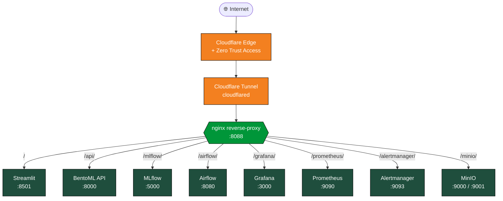

<div align="center">

# 🍄 Champy Classifier

**Classification de 30 espèces de champignons par deep learning, livrée en stack MLOps complète.**

[](https://www.python.org/)
[](https://docs.docker.com/compose/)
[](https://pytorch.org/)
[](https://bentoml.com/)
[](https://mlflow.org/)
[](https://streamlit.io/)
[]()
[]()

**ConvNeXt-Tiny &nbsp;•&nbsp; 90 % accuracy &nbsp;•&nbsp; F1 macro 81 % &nbsp;•&nbsp; Empreinte training ≈ 58 gCO₂eq**

</div>

---

## Équipe et cadre académique

**Travail de Fin d'Études** — Master *Intelligence Artificielle*, DataScientest x Mines Paris PSL (RNCP niveau 7). Soutenance le **16 juin 2026**.

| Co-auteurs | Mentor |
|---|---|
| Loïc FOCRAUD | 🎓 Kylian POILLY |
| Lionel SCHNEIDER | |
| Dominique GEORGES | |
| Saravana PREGASSAME | |

---

## Démarrage rapide

```bash
git clone https://github.com/<votre-org>/Champy_Classifier.git
cd Champy_Classifier
cp .env.example .env
docker compose up -d --build
```

Onze containers démarrent. Comptez 5 à 15 minutes au premier lancement. Une fois la stack opérationnelle, ouvrez **http://localhost:8088** dans votre navigateur.

> 🛠️ **Prérequis** : Docker Desktop 4.30+ (Windows / macOS) ou Docker Engine 24.0+ avec plugin Compose v2 (Linux). 16 Go de RAM. 20 Go de disque libre.

---

## Architecture



Tous les services sont accessibles via un point d'entrée unique (`champy.sbdg-ia.fr`) avec routage par sous-path. Aucun port n'est exposé directement sur Internet : tout transite par Cloudflare Tunnel et est filtré par Cloudflare Access (authentification SSO par e-mail magic-link).

Documentation détaillée : [`docs/ARCHITECTURE.md`](docs/ARCHITECTURE.md).

---

## Accès aux interfaces

| Service | Sous-path | Auth interne | Rôle |
|---|---|---|---|
| 🍄 Streamlit | `/` | bcrypt | Démo interactive, exploration des résultats |
| 🚀 BentoML API | `/api/` | — | Inférence, explicabilité, Swagger UI |
| 📊 MLflow | `/mlflow/` | — | Tracking des expériences, registre de modèles |
| 🌬️ Airflow | `/airflow/` | basic auth | Orchestration des pipelines |
| 📈 Grafana | `/grafana/` | basic auth | Dashboards de monitoring |
| 🔥 Prometheus | `/prometheus/` | — | Métriques time-series |
| 🚨 Alertmanager | `/alertmanager/` | — | Routing des alertes vers Discord |
| 💾 MinIO | `/minio/` | basic auth | Stockage S3-compatible auto-hébergé |

Les identifiants par défaut sont visibles dans la page **Plateforme** du portfolio Streamlit (interface graphique avec boutons « Copier » natifs).

---

## Modèle et empreinte écologique

| Indicateur | Valeur |
|---|---:|
| Architecture | ConvNeXt-Tiny (28 M paramètres) |
| Test accuracy | 90 % |
| F1 macro | 81 % |
| Espèces classifiées | 30 |
| Empreinte training | ≈ 58 gCO₂eq (1 espresso) |
| Empreinte inférence unitaire | ≈ 0,005 mgCO₂eq |
| Rapport vs GPT-4 (entraînement) | × 430 000 moins |

Dashboard Grafana dédié à l'impact écologique : ouvrez Grafana → dashboard **Champy — Impact écologique**.

---

## Documentation complète

<details>
<summary><strong>📦 Configuration des secrets</strong></summary>

<br>

Le fichier `.env.example` contient des valeurs par défaut suffisantes pour une démo locale. Pour une exposition publique, générez vos propres secrets :

```bash
# Clé Fernet (chiffrement des connexions Airflow)
python -c "from cryptography.fernet import Fernet; print(Fernet.generate_key().decode())"

# Clé secrète du webserver Airflow
python -c "import secrets; print(secrets.token_hex(32))"
```

Reportez les valeurs dans `.env` :

```env
AIRFLOW_FERNET_KEY=<sortie de la première commande>
AIRFLOW_WEBSERVER_SECRET=<sortie de la seconde commande>
GRAFANA_PASSWORD=<un mot de passe robuste>
MINIO_ROOT_PASSWORD=<un mot de passe robuste>
AIRFLOW_ADMIN_PASSWORD=<un mot de passe robuste>
```

Puis :

```bash
docker compose up -d --force-recreate airflow grafana minio
```

</details>

<details>
<summary><strong>🖥️ Accès local vs accès public</strong></summary>

<br>

**Accès local** (sur la machine d'installation) :

Tous les services sont accessibles via le hub nginx sur le port 8088 : `http://localhost:8088/<sous-path>/`. Les ports natifs de chaque service restent également exposés pour le debug (Streamlit sur 8501, API sur 8010, Grafana sur 3010, MLflow sur 5050, MinIO console sur 9011, etc.). La liste complète est dans `docker-compose.yml`.

**Accès public** (production) :

En production, la stack est exposée derrière Cloudflare Tunnel et protégée par Cloudflare Access. Une seule authentification SSO donne accès à l'ensemble des sous-paths sous `https://champy.sbdg-ia.fr/`. L'authentification est gérée par e-mail magic-link via Cloudflare Zero Trust. Aucun port n'est ouvert vers Internet sur la machine hôte.

</details>

<details>
<summary><strong>🔬 Premier test de prédiction</strong></summary>

<br>

Le dossier `data/sample/` contient quelques images d'exemple, une par classe principale.

**Via le portfolio Streamlit** (recommandé) :

1. Ouvrez http://localhost:8088/
2. Connectez-vous (compte de démo visible sur la page de connexion)
3. Naviguez vers la page **Prédiction** dans le menu de gauche
4. Sélectionnez une image (upload local, exemple fourni, ou URL distante)
5. Cliquez sur **🚀 Lancer la prédiction**

La page affiche la classe prédite, le top-5 des espèces les plus probables, et une carte de chaleur **Grad-CAM** mettant en évidence les zones de l'image qui ont influencé la décision.

**Via l'API directement** :

```bash
# Prédiction top-5
curl -X POST "http://localhost:8088/api/predict" \
     -F "image=@data/sample/agaricus_bisporus_01.jpg"

# Healthcheck
curl http://localhost:8088/api/healthz

# Métadonnées du modèle
curl http://localhost:8088/api/model/info
```

Documentation OpenAPI : `http://localhost:8088/api/docs.json`.

</details>

<details>
<summary><strong>🛑 Arrêt, redémarrage, désinstallation</strong></summary>

<br>

**Arrêt sans perte de données** :

```bash
docker compose down
```

Les volumes (Postgres Airflow, MLflow, MinIO, Grafana, Prometheus) sont conservés.

**Redémarrage** :

```bash
docker compose up -d
```

**Désinstallation complète** :

```bash
docker compose down -v
docker image prune -a -f --filter "label=com.docker.compose.project=champy_classifier"
```

Pour un nettoyage total, supprimez ensuite le dossier du projet.

</details>

<details>
<summary><strong>🛠️ Dépannage rapide</strong></summary>

<br>

**`Cannot connect to the Docker daemon`**

- Windows : Docker Desktop n'est pas lancé. Démarrez-le et patientez jusqu'au statut « Running ».
- Linux : votre utilisateur n'est pas dans le groupe `docker`. Exécutez `sudo usermod -aG docker $USER`, puis reconnectez-vous.

**`Port is already allocated`**

Un autre service utilise un port que la stack tente d'allouer. Identifiez-le :

- Windows : `Get-NetTCPConnection -LocalPort 8088 | Select-Object OwningProcess`
- Linux : `sudo lsof -i :8088`

Soit vous arrêtez le service conflictuel, soit vous modifiez le port hôte dans `docker-compose.yml`.

**nginx en état `unhealthy` après un `--force-recreate`**

Quand un container backend est recréé, son IP Docker change mais nginx garde l'ancienne en cache DNS. Solution :

```bash
docker compose restart nginx
```

**Streamlit affiche `Connection error` pour l'API**

L'API BentoML n'est pas encore prête. Vérifiez :

```bash
docker compose ps api
docker compose logs --tail 50 api
```

**Airflow refuse de démarrer (`Fernet key must be specified`)**

Le fichier `.env` n'a pas été correctement rempli. Vérifiez la section *Configuration des secrets*.

**Modifications du code Streamlit non prises en compte (Windows)**

Sur Windows Docker Desktop, `runOnSave` ne fonctionne pas de manière fiable. Solution :

```bash
docker compose build demo
docker compose up -d --force-recreate demo
```

Voir [`docs/PLAYBOOK.md`](docs/PLAYBOOK.md) pour la liste complète des pièges connus et recettes de dépannage.

</details>

<details>
<summary><strong>🧑‍💻 Identifiants par défaut</strong></summary>

<br>

En l'absence de configuration explicite dans `.env`, les identifiants par défaut sont :

| Service | Utilisateur | Mot de passe |
|---|---|---|
| Streamlit (admin) | `admin` | `ChampyAdmin2026!` |
| Streamlit (user) | `user` | `ChampyUser2026!` |
| Grafana | `admin` | `changeme` |
| MinIO | `minioadmin` | `changeme_in_env_file` |
| Airflow | `admin` | (généré, voir `.env`) |

**À changer impérativement pour toute exposition publique.** Les identifiants Streamlit (hachés en bcrypt) sont stockés dans `demo/users.yaml`.

</details>

<details>
<summary><strong>📚 Pour aller plus loin</strong></summary>

<br>

- [`docs/ARCHITECTURE.md`](docs/ARCHITECTURE.md) — Architecture détaillée, choix techniques, comparaison des modèles entraînés
- [`docs/PLAYBOOK.md`](docs/PLAYBOOK.md) — Procédures opérationnelles, pièges connus, recettes de dépannage
- [`docs/LOGBOOK.md`](docs/LOGBOOK.md) — Journal des décisions et évolutions du projet
- Page **Plateforme** du portfolio Streamlit — Hub d'accès interactif aux huit services
- Page **Infrastructure** du portfolio Streamlit — Vue détaillée des services avec statuts en temps réel
- Page **Monitoring** — Tableaux de bord Grafana intégrés et métriques live de l'API
- Page **Drift** — Détection de dérive de distribution via Evidently AI
- Dashboard Grafana **Impact écologique** — Empreinte carbone du modèle (entraînement et inférences)

</details>

---

<div align="center">

**Champy Classifier** &nbsp;•&nbsp; Master IA DataScientest x Mines Paris PSL &nbsp;•&nbsp; Promotion 2026

Co-auteurs : Loïc FOCRAUD &nbsp;•&nbsp; Lionel SCHNEIDER &nbsp;•&nbsp; Dominique GEORGES &nbsp;•&nbsp; Saravana PREGASSAME &nbsp;•&nbsp; Mentor : Kylian POILLY

Les jeux de données utilisés (700 000 images de champignons sur 30 espèces) proviennent de Mushroom Observer et iNaturalist, curés pour le projet. Les modèles pré-entraînés ConvNeXt-Tiny et ResNet-50 sont issus de torchvision. Le pipeline MLOps s'appuie exclusivement sur des composants open source auto-hébergés.

</div>
