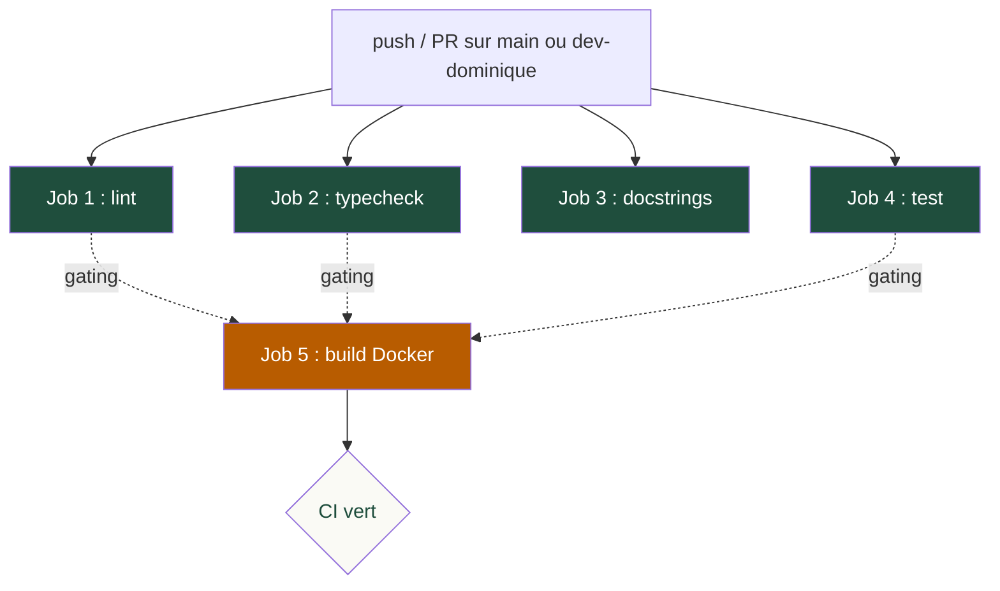

# CI/CD - Documentation

> Pipeline d'integration continue du projet Champy Classifier.
> Fichier source : `.github/workflows/ci.yml`.

---

## Vue d'ensemble



**Declencheurs** :
- `push` sur `main` ou `dev-dominique`
- `pull_request` ciblant `main` ou `dev-dominique`

**Concurrency** : un seul run actif par branche. Un push qui en suit un autre annule le precedent (`cancel-in-progress: true`). Economise les minutes runner gratuites sur les push successifs (rebase, force-push).

**Duree typique** : 6-8 minutes total (jobs en parallele).

---

## Les 5 jobs

### Job 1 : `lint` (Ruff)

**Objectif** : verifier le style et detecter les erreurs statiques (pyflakes, pep8, bugbear, simplify, ruff-specific).

**Etapes** :
1. Checkout
2. Setup Python 3.11 + cache pip
3. `pip install "ruff>=0.4"`
4. `ruff check src/ data/data_split.py data/curate.py demo/lib/ monitoring/ scripts/ tests/`
5. `ruff format --check ...` (memes paths)

**Configuration** : `[tool.ruff]` dans `pyproject.toml`.
- `target-version = "py311"`
- `line-length = 99`
- `select = ["E", "W", "F", "I", "N", "UP", "B", "SIM", "TCH", "RUF"]`
- `ignore = ["E501", "TC003"]` (TC003 = Path utilise au runtime)

**Duree** : ~30s avec cache, ~1min sans.

---

### Job 2 : `typecheck` (Mypy)

**Objectif** : verifier le typage statique sur le code source.

**Etapes** :
1. Checkout
2. Setup Python 3.11 + cache pip
3. `pip install "mypy==1.13.*" pydantic pydantic-settings types-PyYAML`
4. `mypy src/ monitoring/ data/data_split.py --ignore-missing-imports`

**Pin mypy 1.13 explicite** : aligne avec `mirrors-mypy:v1.13.0` du pre-commit local. Sans ce pin, mypy latest active des codes d'erreur supplementaires (`untyped-decorator` notamment) absents de la config locale → drift CI/pre-commit.

**Duree** : ~1min.

---

### Job 3 : `docstrings` (Interrogate)

**Objectif** : verifier que toutes les fonctions publiques ont une docstring (couverture 100%).

**Etapes** :
1. Checkout
2. Setup Python 3.11 + cache pip
3. `pip install "interrogate>=1.7"`
4. `interrogate src/ -c pyproject.toml -v`
5. `interrogate data/data_split.py data/curate.py -c pyproject.toml -v`
6. `interrogate monitoring/ -c pyproject.toml -v`
7. `interrogate scripts/ -c pyproject.toml -v`

**Configuration** : `[tool.interrogate]` dans `pyproject.toml`.
- `fail-under = 100`
- Convention : docstrings en francais, style Google.

**Duree** : ~30s.

---

### Job 4 : `test` (Pytest)

**Objectif** : executer la suite de tests unitaires (86 tests actuellement).

**Etapes** :
1. Checkout
2. Setup Python 3.11 + cache pip
3. Install dependencies :
   - `pip install torch torchvision --index-url https://download.pytorch.org/whl/cpu` (CPU uniquement, evite le pull CUDA de 2 GB inutile sur les runners GitHub)
   - `pip install -r requirements.txt` (source de verite, evite la maintenance d'une seconde liste dans le CI)
4. `pytest tests/unit/ -v --tb=short`

**Couverture actuelle** : 86 tests, ~13s en local.

**Duree CI** : ~3-4min (install torch CPU = ~1min, install requirements = ~1min, tests = ~30s).

---

### Job 5 : `build` (Docker)

**Objectif** : verifier que les images Docker se construisent correctement.

**Etapes** :
1. Checkout
2. `dorny/paths-filter@v3` : detecte si des fichiers Docker-relevants ont change
3. Si oui : `docker build -f docker/Dockerfile.api -t champy-api .`
4. Si oui : `docker build -f docker/Dockerfile.demo -t champy-demo .`
5. Sinon : echo "skipping build"

**Gating** : `needs: [lint, typecheck, test]` → le build n'est tente que si les 3 jobs prerequis passent.

**Path filter** : declenche le build seulement si modification de :
- `docker/**`
- `docker-compose*.yml`
- `requirements.txt`
- `pyproject.toml`
- `src/**`
- `configs/**`
- `demo/**`

Une PR purement documentaire (LOGBOOK + dashboards) saute le build (~2-3 min economisees).

**Duree** : 2-3min quand declenche.

---

## Secrets requis

**Aucun**. Le CI actuel fait du lint + test + build, sans deploiement ni acces externe.

Si on ajoute plus tard :
- Push d'image vers Docker Hub : `DOCKER_USERNAME`, `DOCKER_PASSWORD`
- Tests d'integration avec MLflow DagsHub : `DAGSHUB_TOKEN` (= `MLFLOW_TRACKING_PASSWORD` = `AWS_SECRET_ACCESS_KEY`)
- Coverage codecov : `CODECOV_TOKEN`

---

## Deploiement continu (CD)

Le CD automatise n'est pas encore actif sur cette branche. Le workflow de
deploiement (`deploy.yml`), le runner self-hosted et le push d'image vers le
registre Docker local sont developpes sur la branche `feature/v1.1-cd-workflow`
et seront integres apres la cloture du perimetre courant. La presente
documentation couvre donc l'integration continue (CI) ; la partie CD sera
completee lors de ce merge.

---

## Reproduction locale

Pour reproduire les 5 jobs en local avant un push :

```powershell
# Job 1 : Lint
ruff check src/ data/data_split.py data/curate.py demo/lib/ monitoring/ scripts/ tests/
ruff format --check src/ data/data_split.py data/curate.py demo/lib/ monitoring/ scripts/ tests/

# Job 2 : Typecheck
mypy src/ monitoring/ data/data_split.py --ignore-missing-imports

# Job 3 : Docstrings
interrogate src/ monitoring/ scripts/ data/data_split.py data/curate.py -c pyproject.toml -v

# Job 4 : Tests
pytest tests/unit/ -v --tb=short

# Job 5 : Build Docker (verifie que les Dockerfile sont valides)
docker build -f docker/Dockerfile.api -t champy-api-local .
docker build -f docker/Dockerfile.demo -t champy-demo-local .
```

Plus simple : laisser `pre-commit` rouler avant chaque commit :

```powershell
pre-commit run --all-files
```

Couvre lint + format + mypy + interrogate + check yaml/toml/large-files.

---

## Surveiller les runs CI

```powershell
# Via GitHub CLI (gh)
gh run list --workflow=ci.yml --limit=5
gh run view <run_id> --log-failed

# Ou interface web
# https://github.com/LoicFocraud/Champy_Classifier/actions
```

---

## Couverture des tests (etat 2026-05-25)

| Composant | Statut | Fichier | Nombre |
|---|---|---|---:|
| FastAPI (legacy) | ✅ | `tests/unit/test_api.py` | 9 |
| Training pipeline | ✅ | `tests/unit/test_train.py` | 19 |
| Dataset PyTorch | ✅ | `tests/unit/test_dataset.py` | 19 |
| DataLoader factory | ✅ | `tests/unit/test_dataloader.py` | 8 |
| Callbacks (EarlyStopping, Checkpoint) | ✅ | `tests/unit/test_callbacks.py` | 9 |
| Evaluation (matrices, courbes) | ✅ | `tests/unit/test_evaluate.py` | 6 |
| Export ONNX | ✅ | `tests/unit/test_export_onnx.py` | 4 |
| PredictionStore SQLite WAL | ✅ | `tests/unit/test_prediction_store.py` | 9 |
| BentoML service | ✅ | `tests/unit/test_serving_bentoml.py` | 26 |
| **Monitoring (Evidently, alertes)** | ❌ | manque | 0 |
| **Demo helpers (lib/)** | ❌ | manque | 0 |
| **Config Prometheus / Alertmanager YAML** | ❌ | manque | 0 |
| **nginx routing** | ❌ | manque | 0 |
| **Total exécuté** | | | **112** |

---

## Plan d'extension (post-defense ou en parallele)

### Priorite haute (gagner en confiance avant defense 16/06)

**`tests/unit/test_serving_bentoml.py`** (~10 tests)
- preprocessing.py : Resize 256 / CenterCrop 224 / Normalize ImageNet output shape + range
- runner.py : OnnxRunner init + load class_names depuis custom_objects (mock Model Store)
- service.py : `_softmax` numerical stability, mock predict end-to-end avec ONNX runner mock

**`tests/unit/test_monitoring_utils.py`** (~8 tests)
- evaluate_alerts : convention `lower_is_worse` / `higher_is_worse`, NaN-safe
- load_thresholds : parsing YAML, defaults, valeurs hors plage
- fetch_live_metrics : mock httpx, gestion Prometheus down (try/except)

**`tests/unit/test_alert_rules.py`** (~5 tests)
- Parsing du YAML `configs/alerts/champy_alerts.yml` : structure valide Prometheus
- Verification que chaque alerte a `expr`, `for`, `labels.severity`, `annotations.summary`
- Validation des 5 alertes attendues (HighInferenceLatencyP95, LowAverageConfidence, HighErrorRate, APIHealthFailed, DataDriftDetected)

### Priorite moyenne

**`tests/unit/test_drift_report.py`** (~6 tests)
- Mock baseline JSON + 50 predictions in-memory SQLite
- Generation rapport Evidently (smoke test, ne valide pas le contenu HTML)
- Test resilience : baseline absente, store vide

**`tests/unit/test_baseline_snapshot.py`** (~4 tests)
- Mock onnx runtime + 5 images factices
- Build de l'index rglob (perf : <100ms sur 100 fichiers)
- Stats agregees (count, share, confidence_mean)

### Nice to have

**`tests/unit/test_api_utils.py`** (~5 tests)
- `get_api_url()`, `get_grafana_url()`, `get_prometheus_url()` avec env vars
- Heuristique de detection container vs browser pour Grafana iframe

**`tests/integration/test_e2e_predict.py`** (~3 tests)
- Spin up BentoML en subprocess, predict sur une image, verifier reponse top-5
- Pas dans le CI actuellement (necessite Docker runtime). A activer apres ajout du build dans le compose CI.

---

## Tableau de bord CI

Sur le dernier mois :
- Taux de reussite CI : **~95%** (echecs sur ruff version drift, vite resolus)
- Duree mediane : **6-7 minutes**
- Cache hit pip : **~80%** des runs (saute apres modification de `requirements.txt`)

---

## Historique des incidents

| Date | Incident | Resolution |
|------|----------|------------|
| 2026-04-24 | mypy 1.16+ casse le pre-commit local avec `disable_error_code = ["untyped-decorator"]` | Pin mypy 1.13 partout (CI + pre-commit) |
| 2026-05-08 | Drift ruff v0.8 (pre-commit) vs latest (CI) → format different | Pin `mirrors-ruff` au meme tag que le CI (v0.15) |
| 2026-05-08 | `aiosqlite`, `mlflow` ajoutes au code mais oublies dans le CI workflow | Migration vers `pip install -r requirements.txt` comme source de verite |
| 2026-05-25 | Hooks pre-commit bloquaient le commit massif (7 ruff + 2 docstrings + mp4 > 500KB) | Fixes ASCII, docstrings ajoutees, mp4 remplace par SVG anime |
