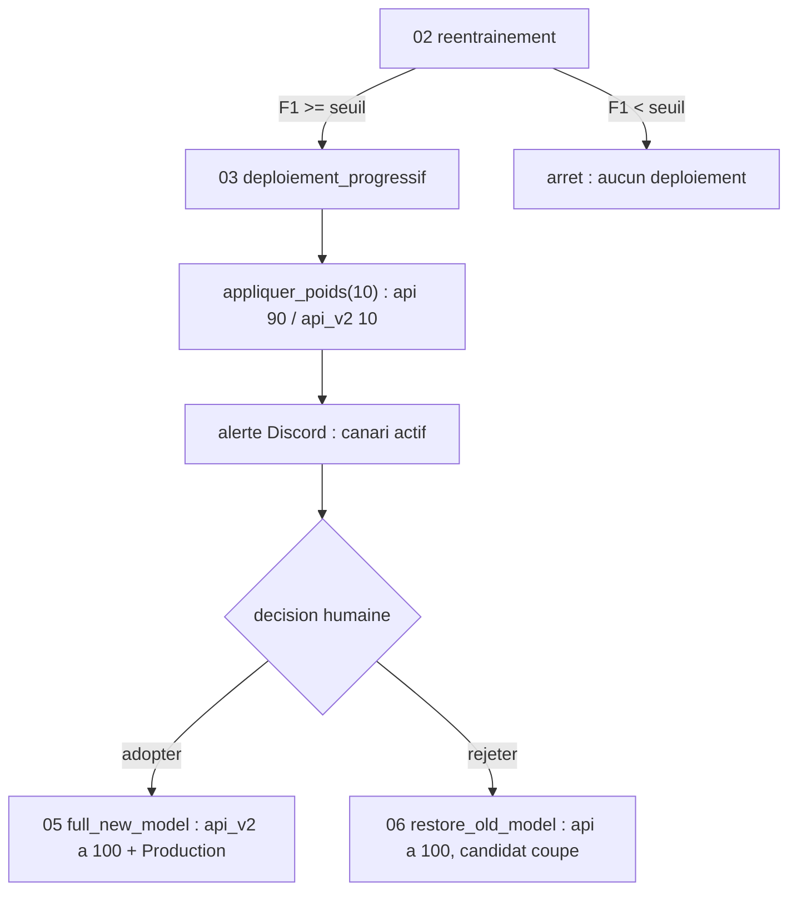

# Déploiement canari du modèle Champy

Date : 11 juin 2026
Projet : Champy Classifier (Master IA Mines Paris PSL)

## Principe

Le déploiement d'un nouveau modèle ne se fait jamais d'un bloc. Le modèle en production (le *champion*, servi par l'instance `api`) garde la main, et le candidat fraîchement réentraîné (le *challenger*, servi par l'instance `api_v2`) ne reçoit d'abord qu'une fraction du trafic. C'est le *canari* : on observe le candidat sur du trafic réel mais limité avant de lui confier l'ensemble.

La décision d'adopter ou de rejeter le candidat n'est pas automatique. À l'issue du réentraînement, si le modèle franchit la porte de qualité (le F1 sur le jeu de test, évalué dans le DAG 02), le canari s'active à 10 % et une alerte Discord prévient un humain, qui tranche. Ce choix du *human-in-the-loop* est assumé : laisser une machine promouvoir seule sur quelques minutes de trafic serait imprudent pour un modèle qui vient de naître.

## Flux

## Composants

**`03_deploiement_progressif`** reçoit la main du DAG 02. Il bascule 10 % du trafic vers le candidat et envoie l'alerte Discord. Il ne décide rien : la suite est humaine.

**`05_champy_full_new_model`** est la réponse « on adopte ». Il envoie 100 % du trafic sur le candidat et le passe en Production dans le registre MLflow, l'ancien champion étant archivé.

**`06_champy_restore_old_model`** est la réponse « on rejette ». Il coupe le candidat et rend tout le trafic au champion. Le candidat n'ayant pas été promu, le registre reste inchangé.

**`champy_canary.py`** est le module commun aux trois DAG. Il centralise la bascule de trafic (`appliquer_poids`, qui réécrit l'upstream NGINX et le recharge à chaud) et l'alerte (`alerter_discord`). Cette factorisation évite de dupliquer la mécanique trois fois.

**`api_v2`** est l'instance challenger, déclarée dans le `docker-compose.yml` sous le profil `canary`. Elle ne démarre donc jamais lors d'un `docker compose up` normal : la stack de production n'est pas affectée tant que le canari n'est pas explicitement lancé.

## État d'activation

Le code des trois DAG, le module commun et le service `api_v2` sont en place et cohérents. Le **routage live** du trafic, lui, n'est volontairement pas branché dans cette V1. L'activer demanderait de modifier des éléments qui fonctionnent et servent toute la démonstration (le reverse proxy NGINX porte aussi MLflow, Grafana, Airflow et l'interface Streamlit), ce qui n'est pas un risque à prendre à quelques jours de la soutenance.

Les prérequis d'activation, identifiés et documentés ici pour montrer que l'absence de branchement est un choix et non un oubli :

1. Un dossier d'upstream partagé entre Airflow et NGINX. Aujourd'hui NGINX ne monte que `nginx.conf` en lecture seule, et Airflow monte `configs` en lecture seule. Il faut un volume `conf.d` monté en écriture côté Airflow et en lecture côté NGINX, à l'emplacement `/etc/nginx/conf.d/`.
2. Une directive `include /etc/nginx/conf.d/*.conf;` dans `nginx.conf`, et un `location /api/` pointant sur l'upstream `champy_api` au lieu du `proxy_pass http://api:8000/` direct actuel.
3. Le socket Docker (`/var/run/docker.sock`) monté dans le conteneur Airflow et le paquet `docker` ajouté à son image, pour que le DAG puisse recharger NGINX.
4. Le démarrage du challenger : `docker compose --profile canary up -d api_v2`.

## Évolutions conçues, non branchées

La promotion reste manuelle dans cette V1. L'automatiser supposerait trois compléments, laissés en commentaires dans le DAG 03 comme trace de conception :

- une fenêtre d'observation de quinze à trente minutes entre la bascule à 10 % et la mesure, sans quoi la comparaison lit des séries Prometheus vides et promeut systématiquement ;
- des métriques distinguant les deux versions, là où l'API expose aujourd'hui `bentoml_service_request_total` sans label de version ;
- des seuils de décision explicites sur le taux d'erreur et la latence.

Après une adoption, une rotation propre rechargerait le nouveau modèle dans l'instance `api` et remettrait `api_v2` en attente du prochain candidat, afin que les rôles champion et challenger tournent au fil des déploiements.
