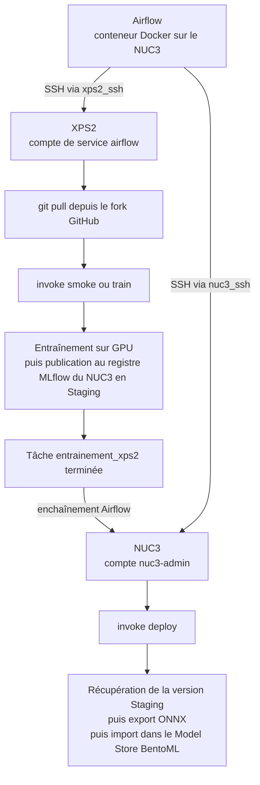

# Réentraînement Champy : DAG Airflow orchestré par SSH

Date : 8 juin 2026
Contexte : mise en service du DAG `champy_reentrainement`, qui automatise la boucle complète entraînement puis déploiement sur deux machines, depuis Airflow.

---

## Objectif

Automatiser la chaîne MLOps de bout en bout : un seul déclenchement doit entraîner le modèle sur la machine GPU (XPS2), publier le résultat au registre de modèles, puis déployer ce modèle sur la machine de service (NUC3). Plus aucune copie manuelle entre les deux machines.

Le code voyage par Git, le modèle par le registre MLflow, et Airflow ne fait qu'orchestrer : il ne porte ni PyTorch, ni le code, ni le modèle. Chaque étape rejoue, par SSH, exactement la commande qu'on lançait à la main.

Quelques termes, expliqués une fois :
- **Airflow** : l'outil qui planifie et enchaîne des tâches (ici, un « DAG » est une suite de tâches avec leurs dépendances). Il tourne dans un conteneur Docker sur le NUC3.
- **SSHOperator** : la brique Airflow qui exécute une commande sur une machine distante via SSH. Sous le capot, elle utilise **paramiko**, une bibliothèque SSH en Python.
- **OpenSSH Server (sshd)** : le service côté machine distante qui accepte les connexions SSH entrantes.
- **invoke** : le lanceur de tâches du projet (l'équivalent d'un Makefile), qui expose `invoke smoke`, `invoke train`, `invoke deploy`.

---

## Architecture

La tâche `entrainement_xps2` s'exécute d'abord, et seulement si elle réussit, `deploiement_nuc3` s'enchaîne.

---

## Le chemin parcouru : obstacles et solutions

Le câblage a buté sur une série de pièges, tous propres à un environnement Windows à deux machines. Voici chacun, avec sa cause et sa solution, dans l'ordre où ils sont apparus.

### 1. Impossible d'ouvrir une session SSH sous le compte AzureAD

Le compte principal du XPS2 est un compte AzureAD (Entra). L'authentification par clé fonctionnait (sshd acceptait la clé), mais l'ouverture de la session échouait juste après, avec une `EOFError` côté client. C'est une limitation connue d'OpenSSH sous Windows : le service n'arrive pas à créer le processus de session sous un jeton AzureAD.

Solution : créer un **compte local de service** dédié, nommé `airflow`, membre du groupe Administrateurs local. Sous un compte local classique, la création de session fonctionne normalement, exactement comme sur le NUC3 (dont le compte `nuc3-admin` est local). C'est aussi la bonne pratique pour de l'automatisation : un compte de service dédié, pas le compte personnel.

### 2. OpenSSH ne s'installait pas par la voie normale

Sur le XPS2, `Add-WindowsCapability -Online -Name OpenSSH.Server` échouait avec « le magasin de composants a été endommagé », séquelle d'une mise à niveau Windows ratée. Réparer le magasin (`DISM /Online /Cleanup-Image /RestoreHealth`) est long et incertain.

Solution : installer l'**OpenSSH portable officiel de Microsoft** (Win32-OpenSSH), récupéré depuis GitHub et installé par son script `install-sshd.ps1`. Cette voie ne dépend pas du magasin de composants. La réparation du magasin reste une dette à traiter à part, sans lien avec ce projet.

### 3. La clé publique au bon endroit, selon le type de compte

Sous Windows, OpenSSH ne lit pas `~/.ssh/authorized_keys` pour les comptes administrateurs : il lit `C:\ProgramData\ssh\administrators_authorized_keys`, avec des droits stricts (seuls Administrateurs et SYSTEM). Sur le NUC3 (compte local admin), c'est ce fichier qui porte la clé.

Sur le XPS2, le compte AzureAD n'était pas reconnu comme administrateur par sshd au moment de choisir le fichier de clés ; sshd cherchait donc la clé dans le profil de l'utilisateur. Une fois passé au compte local `airflow` (vraiment admin local), la clé déjà déposée dans `administrators_authorized_keys` a été lue correctement.

Détail Windows : les droits du fichier se posent par identifiant de sécurité (SID), pas par nom de groupe, car le XPS2 est en français (« Administrateurs », pas « Administrators »). On utilise `*S-1-5-32-544` (administrateurs) et `*S-1-5-18` (SYSTEM), qui sont universels.

### 4. Le `git pull` du DAG et l'accès au dépôt privé

La tâche d'entraînement fait `git pull` avant d'entraîner, pour partir du code à jour. Sous le compte de service `airflow`, deux verrous :
- **Authentification** : le dépôt est privé. Il faut un jeton d'accès (PAT) puisque le compte de service n'a pas les identifiants en cache.
- **Propriété** : le dépôt a été cloné par le compte AzureAD ; git refuse qu'un autre compte y opère (« dubious ownership »). Levé par `git config --system --add safe.directory <chemin>`.

Sur le type de jeton : un PAT **fine-grained** ne donne accès qu'aux dépôts appartenant à son propriétaire. Le dépôt principal appartient à un autre compte (collaboration), donc le fine-grained y est refusé (erreur 403). Deux issues : un PAT **classic** (portée `repo`, plus large) sur le dépôt principal, ou bien tirer depuis **le fork personnel**, sur lequel le PAT fine-grained en lecture seule fonctionne.

Choix retenu : faire tirer le XPS2 depuis le **fork personnel**. Le fork et le dépôt principal restent synchronisés par le « push all » habituel, et ce choix limite les privilèges du jeton au strict nécessaire. Le remote `origin` du XPS2 pointe donc le fork, jeton fine-grained inclus dans l'URL.

### 5. Le bon interpréteur Python, sans activation de venv

Premier vrai échec du DAG : `ModuleNotFoundError: No module named 'mlflow'`. La trace montrait que c'était le Python global du Microsoft Store qui s'exécutait, pas celui du venv du projet.

Cause : `invoke smoke` appelle en interne `python -m src.training.train`. Ce `python` nu est résolu par le PATH. En session interactive, on active le venv avant, donc `python` pointe le venv. Mais en SSH non interactif, le venv n'est pas activé, et `python` retombe sur le Python global, qui n'a ni MLflow ni PyTorch.

Solution, dans `tasks.py` : appeler le Python du venv courant via `sys.executable` au lieu de `python` nu. Comme `invoke.exe` est lancé depuis le venv, `sys.executable` pointe précisément le bon interpréteur, avec ou sans activation. Robuste dans tous les cas.

### 6. L'encodage UTF-8 du processus invoke lui-même

Deuxième échec : `UnicodeEncodeError` sur un caractère hors cp1252, au moment où `invoke` relaie la sortie de son sous-processus.

Cause, plus subtile que la précédente : le sous-processus d'entraînement écrivait bien en UTF-8 (variable `PYTHONUTF8=1` déjà passée au sous-processus). Mais `invoke`, le processus parent, relaie cette sortie sur **son propre** flux de sortie, en cp1252 sous un compte sans `PYTHONUTF8`. En manuel, la session de l'utilisateur portait la variable ; sous le compte de service `airflow`, non.

Solution : préfixer les commandes du DAG par `$env:PYTHONUTF8='1';`. Ainsi le processus `invoke` lui-même est en UTF-8 et relaie la sortie (accents, emoji que MLflow affiche en fermant un run) sans planter.

---

## Configuration finale, reproductible

Côté machines distantes (XPS2 et NUC3) :
- OpenSSH Server actif, shell SSH par défaut réglé sur PowerShell (clé de registre `HKLM:\SOFTWARE\OpenSSH\DefaultShell`).
- Une clé SSH dédiée à Airflow, dont la clé publique est autorisée (dans `administrators_authorized_keys` pour un compte admin local, ou dans le profil de l'utilisateur selon le cas).
- Sur le XPS2 : compte de service local `airflow`, admin local ; `origin` pointe le fork avec un PAT en lecture ; `git config --system safe.directory` posé.

Côté Airflow (conteneur sur le NUC3) :
- Provider SSH présent dans l'image.
- Deux connexions, type SSH, clé privée stockée en ligne dans la connexion (donc persistante) :
  - `nuc3_ssh` : hôte `host.docker.internal`, login `nuc3-admin`.
  - `xps2_ssh` : hôte = IP Tailscale du XPS2, login `airflow`.
- Le conteneur joint le NUC3 par `host.docker.internal` et le XPS2 par son adresse Tailscale.

Côté code :
- `tasks.py` : interpréteur du venv via `sys.executable` ; `PYTHONUTF8=1` passé aux sous-processus.
- DAG `champy_reentrainement.py` : commandes préfixées par `$env:PYTHONUTF8='1';`, `Set-Location` vers le bon dossier sur chaque machine, `git pull` puis `invoke`.

---

## État validé

Boucle complète exécutée avec succès le 8 juin 2026 (run `manual__2026-06-08T07:26:40`) :
- `entrainement_xps2` : entraînement court (smoke) sur le GPU du XPS2, modèle publié au registre du NUC3 en Staging (version 3), tâche en `success`.
- `deploiement_nuc3` : récupération de la version Staging, export ONNX, import dans le Model Store BentoML, run global en `success`.

Garde-fou d'usage : avant chaque déclenchement réel, vérifier que le « push all » a bien synchronisé le fork, sinon le XPS2 entraînerait sur du code en retard.

Dettes connues, à traiter hors du chemin critique :
- Magasin de composants du XPS2 endommagé (réparation DISM).
- Mot de passe MinIO qui fonctionne par coïncidence des deux côtés (saut de ligne manquant identique dans les deux fichiers `.env`) : à corriger sur les deux machines en même temps.
- Jeton GitHub en clair dans la configuration git locale : acceptable sur machine personnelle, révocable.
